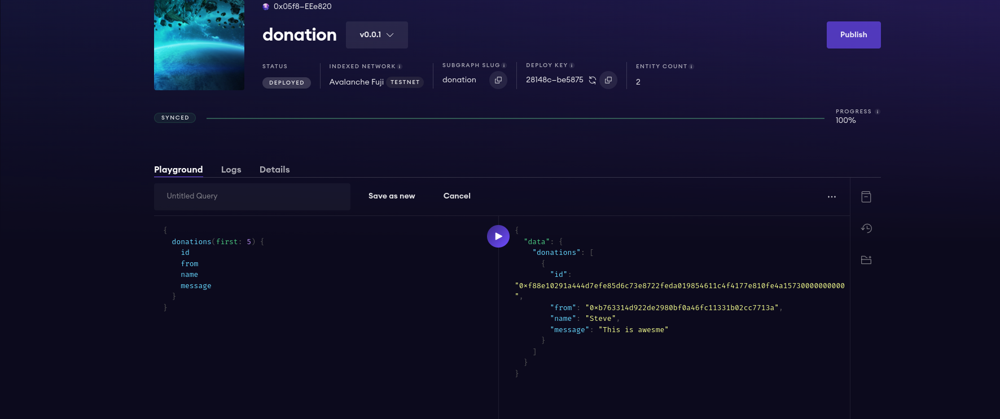

#  Donation DApp Website 

This Decentralized application (DAPP) demonstrates an application for people to get donations for their projects or humanity use cases.

## Main functionalities of the Project

- Creating fundraising campaigns

- Updating fundraising campaigns

- Donating to campaigns

- Deleting campaigns

- Withdrawing funds

- Refunding funds(in case of emergency and campaign deleting)

## Live Demo
- Test the Application at: [Live Demo](https://donation-dapp-beta.vercel.app/)

### Contract Address: 0xb94653d869ed7b388b59beb69905670d0a834b7d

https://sepolia.scrollscan.com/address/0xb94653d869ed7b388b59beb69905670d0a834b7d


## Graph Query 

```

  const query = `
    {
      donations(first: 10, orderBy: id) {
      from
      id
      message
      name
      timestamp
      }
    }
  `;

```

- **Author**: Harsh Agrawal & Venky Kumar

- **`GitHub`**: [harshagrawal2503](https://github.com/harshagrawal2503)
- **`GitHub`**: [BoddepallyVenkatesh06](https://github.com/BoddepallyVenkatesh06)

## ScreenShot




